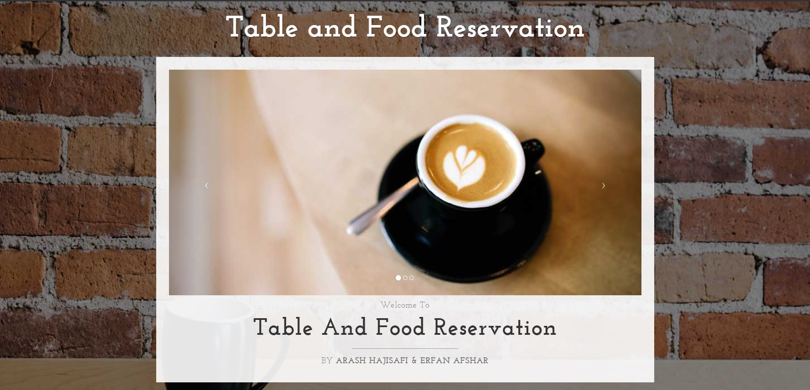

That's MyTable v2!- Online Restaurant Table Reservation Application
----------------------------------------------------------------

  

That's MyTable V2 is a Java Spring MVC and Hibernate project used for the implementation of my Software Engineering (I) project for table booking and food reservations in a restaurant.
- Forked from [That's MyTable!](https://github.com/ekta2391/Thats-MyTable-Restaurant-Table-Booking-Web-Application), a Github repository which we applied different software evolution and maintenance techniques on to adapt the project with newer versions of Java and Spring framework and added many new functionalities such as food reservations and a better implementation for table booking and time management as well as fixing numerous bugs.
- Re-wrote the entire database from the ground up to adapt it with new functionalities

Spring MVC Architecture
-------------------------------------------------------------------
This application is built on the Spring MVC architecture where we have our :
* Model(M)- Stores data as per the instruction given by the controller(Eg: POJO for User.java, Restaurant.java, etc)
* View(V)- rendered as per the flow of the application(Eg: home.jsp, login.jsp, etc)
* Controller(C)- Has the logic that takes in the input parameters and renders the respective view(Eg: LoginController.java,                                  RestaurantController.java, etc)

Setup
-----
The Spring application can be run on any server of your choice. In this application Spring Tool Suite has been set up to leverage the Tomcat Server. 

1. <b>pom.xml:</b>All the  dependencies and version information for the project are added in this xml file.
2. src/main/java/<b>hibernate.cfg.xml</b>: Your connection information for your database connection. Please enter your local database connection information i.e. database name, username and password for your database connection in this file for respective properties.

Running the Project
--------------------
Typically this project has been built and run in Spring Tool Suite.
* 1. Start the Tomcat Server
* 2. Run the project on your local server of choice 
* 3. Type in: http://localhost:8080/ThatsMyTable/ in your browser (enter the port number your server is running on) to open the homepage.

Application Flow
------
* Restaurant Admin: You can sign up or register a restaurant account to the system.The restaurant is now visible to any user.
* User: You can create an account and then sign in to view restaurants that are available as per each city. The user can see the availability of tables available at a particular restaurant and make a booking.
* Update table booking status: The restaurant admin can update the table availability in his system for the user to access.

